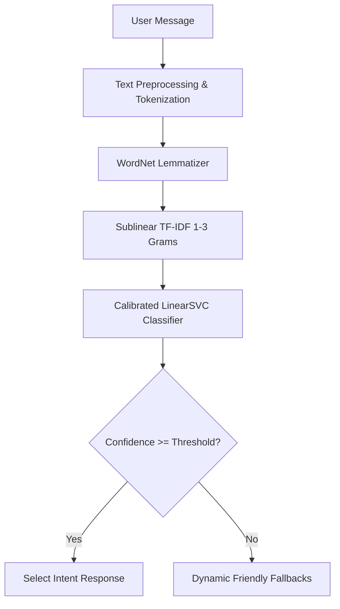

# 🤖 Azale — High-Capacity Conversational ML Chatbot

[](https://www.python.org/)
[](https://streamlit.io/)
[](https://scikit-learn.org/)
[](https://www.nltk.org/)
[](LICENSE)

A lightweight, high-performance conversational chatbot powered by **Streamlit**, **scikit-learn**, and **NLTK**. Trained on a synthetic dataset of **151 intent categories** and **5,828 pattern variations**—operating 100% locally with zero external API costs or latency.

---

## 🌟 Key Features

- **Large-Scale Intent Classification**: Pre-trained on 151 intents covering Programming, Computer Science, AI/ML, Science, DevOps, and Daily Small Talk.
- **Calibrated Machine Learning Engine**: Built using a scikit-learn pipeline featuring sublinear TF-IDF vectorization (1-3 n-grams) and a 3-fold calibrated Support Vector Classifier (`CalibratedClassifierCV` + `LinearSVC`).
- **Conversational Token Preprocessing**: Designed to preserve conversational tokens (`how`, `are`, `you`, `what`, `is`), preventing empty string classification failures on common phrases.
- **Dynamic Confidence Slider**: Real-time slider in Streamlit sidebar allows users to tune prediction strictness on the fly.
- **Informative Knowledge Responses**: Includes clear summaries for programming languages, algorithms, cloud tools, math, and daily conversation.

---

## 📊 Dataset Overview (`intents_huge.py`)

| Topic Domain | Included Intents & Knowledge Areas |
| :--- | :--- |
| **Conversational & Small Talk** | Greetings, Farewell, Gratitude, How Are You, Identity, Jokes, Moods, Help |
| **Artificial Intelligence** | Machine Learning, Deep Learning, NLP, Computer Vision, AI Ethics, Data Science |
| **Programming Languages** | Python, JavaScript, Java, C++, HTML, CSS, SQL, React, Node.js |
| **DevOps & Cloud** | Docker, Kubernetes, Cloud Computing, DevOps, Linux, Windows, Networking, Cybersecurity |
| **CS Fundamentals** | Algorithms, Data Structures, System Design, Git, GitHub, Databases, API Design |
| **Sciences & Math** | Mathematics, Statistics, Physics, Chemistry, Biology, Astronomy, Economics |

---

## 🚀 Quick Start Guide

### 1. Clone the Repository

```bash
git clone https://github.com/YOUR_USERNAME/Chatbot-with-ML-NLP.git
cd Chatbot-with-ML-NLP
```

### 2. Install Dependencies

```bash
pip install -r requirements.txt
```

### 3. Run the Streamlit Application

```bash
streamlit run app.py
```

Open your browser to `http://localhost:8501`.

---

## 📐 Architecture Overview



---

## 📄 License

This project is open-source under the [MIT License](LICENSE).